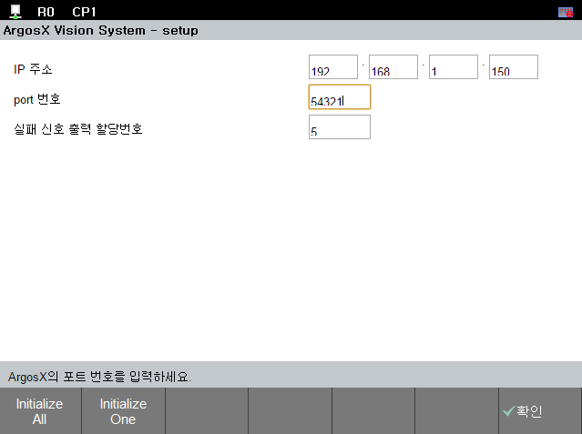

# 3.6.1.2 설정화면 U/I의 번역 

## setup layout에서의 변경

설정화면의 U/I의 번역을 위해 먼저 setup.html을 살펴봅시다.

str_table.json과 lang.js를 아래와 같이 script로 추가해 줍니다.

해당 파일들은 서로에게 종속성이 있기때문에 반드시 하기와 같은 순으로 작성해주어야 합니다.

```html
    <script src='./str_table.json' type='application/json'></script>
    <script src='../../_common/js/lang.js'></script>
    <script src='../../_common/js/dst_setup.js'></script>
```
또한 body에 선언되어 있는 contents들을 살펴 보면
```html
    <span class='col0' name='ip_addr'>IP address</span>
```
IP address 라고 작성되어 있는 span의 내용은 생략하셔도 무방합니다.
(추후에 번역된 내용들이 작성됩니다.)

위와 같은 내용들을 다 반영한 html 파일은 아래와 같이 작성됩니다.

setup.html

```html
    <!DOCTYPE html:5>
    <!--
        @author: Jane Doe, BlueOcean Robot & Automation, Ltd.
        @brief: ArgosX Vision System interface - setup
        @create: 2021-12-06
    -->
    <html>
    
    <head>
    <title>ArgosX Vision System - setup</title>
    <meta http-equiv=Content-Type content='text/html; charset=utf-8'>
        <link rel='stylesheet' href='../../_common/css/style.css' type=text/css rel=stylesheet>
        <script src='../../_common/js/jquery-3.6.0.min.js'></script>
        <script src='../../_common/js/Parser.js'></script>
        <script src='../../_common/js/sigcode.js'></script>
        <script src='./str_table.json' type='application/json'></script>
        <script src='../../_common/js/lang.js'></script>
        <script src='../../_common/js/dst_setup.js'></script>
        <script src='./setup.js'></script>
        <script> 
            $(document).ready(init);
        </script>
    </head>
    
    <body class='no-scroll'>
    <div>
        <div id='contents'>
                <span class='col0' name='ip_addr'></span>
                <input class='col1' type='text' name='ip_addr' id='ip_addr_0' size='3'/>
                .
                <input class='col1' type='text' name='ip_addr' id='ip_addr_1' size='3'/>
                .
                <input class='col1' type='text' name='ip_addr' id='ip_addr_2' size='3'/>
                .
                <input class='col1' type='text' name='ip_addr' id='ip_addr_3' size='3'/>
                <br>
                <span class='col0' name='port'></span>
                <input class='col1' type='text' id='port' size='5'/>
                <br>
                <span class='col0' name='sigcode_err'></span>
                <input class='col1' type='text' id='sigcode_err' size='5'/>
            </div>
            <div id='guidebar'></div>
    </div>
    </body>
    </html>
````


## setup의 번역 동작 추가
이제 setup 화면에 번역 동작을 추가해봅시다.

### 1) 초기화 

먼저 초기화 단계에서 str_table.json의 데이터를 로드해오는 동작과 Hi6에서 읽어온 lang_code를 개방화 플랫폼 다국어화에 반영시켜 주는 동작을 추가 해줍니다.

setup.js

```js

function init()
{
	parseStrData();
	setDomPath('/apps/argosx/svr_general');
	setLangCode('/apps/argosx/svr_lang_code', updateAllStrByLang);
	setUpdateData(updateData);
	onReady();
}

```

parseStrData 는 string data를 로드해오는 함수입니다.

setLangcode는 python의 함수를 호출하여 Hi6에 설정되어있는 lang_code를 읽어오는 동작을 하며, callback 함수로 updateAllStrByLang 를 설정하는 함수입니다.

setLangcode의 동작을 위해 main.py에 get_lang_code라는 함수를 추가해줍니다.

main.py에 추가하는 이유는 추후에, ubar와 panel에서 역시 lang_code를 공통적으로 사용하는 것응 용이하게 하기 위함입니다.

main.py 

```python

def get_lang_code()->dict:
	""" Get language code from remote
	
	Returns: data: information of language code

	"""
	data = {}
	lang_code = xhost.lang_code()
	print(lang_code)
	data["lang_code"] = lang_code
	return data 

```

위의 함수는 xhost의 lang_code 함수를 이용하여 읽어온 lang_code를 반환합니다.


### 2) lang_code에 따른 번역 지정

callback 함수로 지정한 updateAllStrByLang는 updateElement 과 updateGuideBarMsg를 호출하는 함수 이며, 각각 lang_code에 따라서 각 element들과 guidebar의 메세지들을 번역하는 동작을 합니다.

기존의 updateGuideBar 함수 대신 updateGuideBarMsg를 사용하게 됩니다.

먼저 str_table.json에 번역이 필요한 element들과 guidebar 메세지들을 추가해줍니다.

str_table.json

```json
{
      "en":
        {
          "IDS_title" : "ArgosX Vision System",
          "IDS_IpAddr" :"IP Address",
          "IDS_Port" : "Port#",
          "IDS_OUtSigcodeErr" : "Failure output signal",
          "IDS_msg_ip_addr" : "Enter the IP address of ArgosX.",
          "IDS_msg_port" : "Enter the port # of ArgosX.",
          "IDS_msg_sigcode" :"Enter the number of the signal to assign.[0 - 4096]"
      },    
      "ko": 
      {
        "IDS_title" : "ArgosX 비전 시스템",
        "IDS_IpAddr" :"IP 주소",
        "IDS_Port" : "port 번호",
        "IDS_OUtSigcodeErr" : "실패 신호 출력 할당번호",
        "IDS_msg_ip_addr" : "ArgosX의 IP 주소값을 입력하세요.",
        "IDS_msg_port" : "ArgosX의 포트 번호를 입력하세요.",
        "IDS_msg_sigcode" :"할당할 신호의 번호를 입력하세요 [0~4096]."
      }
}
```

다음으로, setup.js 에 하기 내용으로 수정해줍니다.

```js
///@brief	update all string by language code
function updateAllStrByLang()
{
	updateElement();
	updateGuideBarMsg();
}

///@brief	update all element by language code
function updateElement()
{
	let se = setElemByLang;
	se('ip_addr', 'IDS_IpAddr');
	se('port', 'IDS_Port');
	se('sigcode_err', 'IDS_OUtSigcodeErr');
}


///@brief	have guidebar display message on clicking widget & update msg by langcode
function updateGuideBarMsg()
{
	let sg = setGuideMsgByLang;
	sg('ip_addr', 'IDS_msg_ip_addr');
	sg('port', 'IDS_msg_port');
	sg('sigcode_err', 'IDS_msg_sigcode');
}

```

setElemByLang과 setGuideMsgByLang 을 통해서 각 element들과 guidebar 메세지에 string id를 지정해줍니다.

가상 제어기와 TP를 재부팅한 뒤, 정상 동작이 된다면 아래와 같은 설정화면을 확인하실 수 있습니다.



