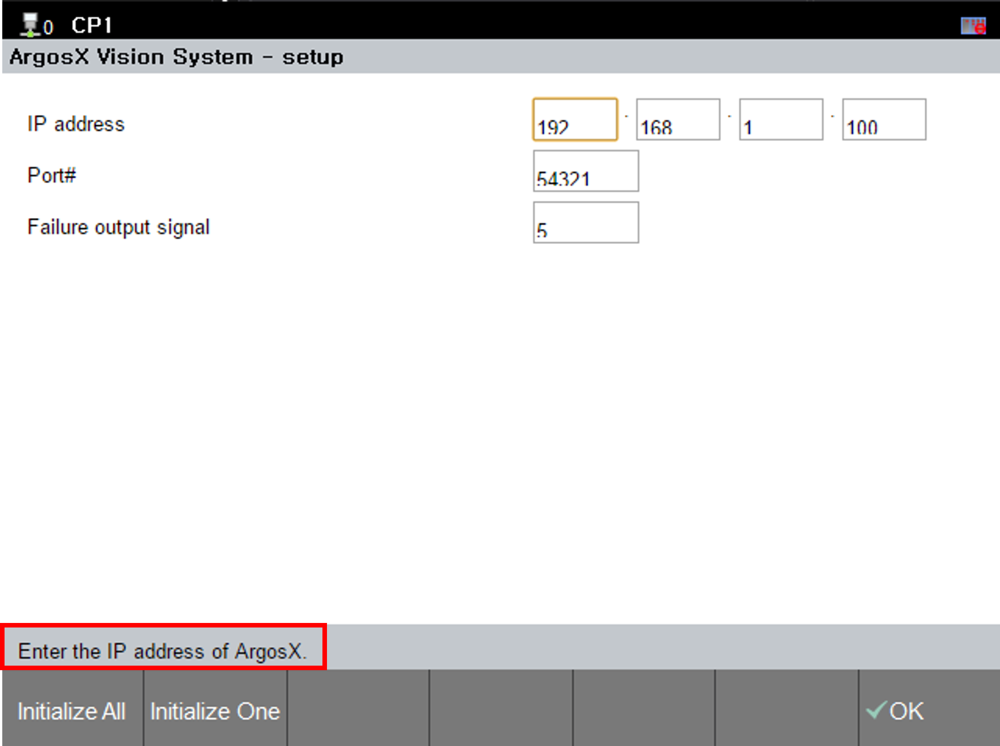

#### 3.6.1.2 翻译设置屏幕用户界面

##### 设置布局中的更改

要翻译设置屏幕的用户界面，首先打开并查看 setup.html。

按照下面所示的方式添加 str_table.json 和 lang.js 作为脚本文件。

因为这些文件相互依赖，所以您必须按以下顺序包含它们。

```html
<script src='./str_table.json' type='application/json'></script>
<script src='../../_common/js/lang.js'></script>
<script src='../../_common/js/dst_setup.js'></script>
```

此外，请检查主体中声明的内容：

```html
<span class='col0' name='ip_addr'>IP 地址</span>
```

您可以删除文本“IP 地址”。  
（翻译的文本将在稍后插入。）

在应用所有上述更改后，html 文件应该看起来像这样：

setup.html

```html
<!DOCTYPE html:5>
<!--
    @author: Jane Doe, BlueOcean Robot & Automation, Ltd.
    @brief: ArgosX Vision System interface - setup
    @create: 2021-12-06
-->
<html>

<head>
<title>ArgosX 视觉系统 - 设置</title>
<meta http-equiv=Content-Type content='text/html; charset=utf-8'>
    <link rel='stylesheet' href='../../_common/css/style.css' type=text/css rel=stylesheet>
    <script src='../../_common/js/jquery-3.6.0.min.js'></script>
    <script src='../../_common/js/Parser.js'></script>
    <script src='../../_common/js/sigcode.js'></script>
    <script src='./str_table.json' type='application/json'></script>
    <script src='../../_common/js/lang.js'></script>
    <script src='../../_common/js/dst_setup.js'></script>
    <script src='./setup.js'></script>
    <script>
        $(document).ready(init);
    </script>
</head>

<body class='no-scroll'>
<div>
    <div id='contents'>
            <span class='col0' name='ip_addr'></span>
            <input class='col1' type='text' name='ip_addr' id='ip_addr_0' size='3'/>
            .
            <input class='col1' type='text' name='ip_addr' id='ip_addr_1' size='3'/>
            .
            <input class='col1' type='text' name='ip_addr' id='ip_addr_2' size='3'/>
            .
            <input class='col1' type='text' name='ip_addr' id='ip_addr_3' size='3'/>
            <br>
            <span class='col0' name='port'></span>
            <input class='col1' type='text' id='port' size='5'/>
            <br>
            <span class='col0' name='sigcode_err'></span>
            <input class='col1' type='text' id='sigcode_err' size='5'/>
        </div>
        <div id='guidebar'></div>
</div>
</body>
</html>
```
<br>

##### 将翻译行为添加到设置

现在让我们在设置屏幕中添加翻译功能。

<br>

1) 初始化

在初始化期间，添加逻辑以从 str_table.json 加载数据，并将从 ${cont_model} 读取的 lang_code 应用到平台的本地化系统。

setup.js

```js
function init()
{
    parseStrData();
    setDomPath('/apps/argosx/svr_general');
    setLangCode('/apps/argosx/svr_lang_code', updateAllStrByLang);
    setUpdateData(updateData);
    onReady();
}
```

parseStrData 加载字符串数据。

setLangCode 调用一个 Python 函数以读取在 ${cont_model} 中配置的 lang_code，并将 updateAllStrByLang 设置为回调。

为了支持 setLangCode，将 get_lang_code 函数添加到 main.py。

它被添加到 main.py 中，以便 ubar 和面板可以共享相同的 lang_code。

main.py

```python
def get_lang_code()->dict:
    """ 从远程获取语言代码

    返回: data: 语言代码的信息
    """
    data = {}
    lang_code = xhost.lang_code()
    print(lang_code)
    data["lang_code"] = lang_code
    return data
```

此函数使用 xhost.lang_code() 返回 lang_code。
<br>

2) 根据 lang_code 应用翻译

回调函数 updateAllStrByLang 调用 updateElement 和 updateGuideBarMsg。  
这些函数根据 lang_code 翻译元素和引导栏消息。

首先，将所需元素和引导栏消息添加到 str_table.json。

```json
{
    "en":
    {
        "IDS_title" : "ArgosX Vision System",
        "IDS_IpAddr" :"IP Address",
        "IDS_Port" : "Port#",
        "IDS_OUtSigcodeErr" : "Failure output signal",
        "IDS_msg_ip_addr" : "Enter the IP address of ArgosX.",
        "IDS_msg_port" : "Enter the port # of ArgosX.",
        "IDS_msg_sigcode" :"Enter the number of the signal to assign.[0 - 4096]"
    },
    "ko":
    {
        "IDS_title" : "ArgosX Vision System",
        "IDS_IpAddr" :"IP Address",
        "IDS_Port" : "Port#",
        "IDS_OUtSigcodeErr" : "Failure output signal",
        "IDS_msg_ip_addr" : "Enter the IP address of ArgosX.",
        "IDS_msg_port" : "Enter the port # of ArgosX.",
        "IDS_msg_sigcode" :"Enter the number of the signal to assign.[0 - 4096]"
    },
    "zh": 
    {
        "IDS_title" : "ArgosX 视觉系统",
        "IDS_IpAddr" :"IP 地址",
        "IDS_Port" : "端口#",
        "IDS_OUtSigcodeErr" : "输出信号失败",
        "IDS_msg_ip_addr" : "请输入 ArgosX 的 IP 地址。",
        "IDS_msg_port" : "请输入 ArgosX 的端口 #。",
        "IDS_msg_sigcode" :"请输入要分配的信号编号。[0 - 4096]"
    }
}
```

接下来，修改 setup.js 如下。

删除现有的 updateGuideBar 函数，改用 updateGuideBarMsg。

```js
/// @brief 按语言代码更新所有字符串
function updateAllStrByLang()
{
    updateElement();
    updateGuideBarMsg();
}

/// @brief 按语言代码更新所有元素
function updateElement()
{
    let se = setElemByLang;
    se('ip_addr', 'IDS_IpAddr');
    se('port', 'IDS_Port');
    se('sigcode_err', 'IDS_OUtSigcodeErr');
}

/// @brief 在点击组件时显示引导栏消息并按语言代码更新消息
function updateGuideBarMsg()
{
    let sg = setGuideMsgByLang;
    sg('ip_addr', 'IDS_msg_ip_addr');
    sg('port', 'IDS_msg_port');
    sg('sigcode_err', 'IDS_msg_sigcode');
}
```
使用 setElemByLang 和 setGuideMsgByLang 将字符串 ID 分配给每个元素和引导栏消息。

重启虚拟控制器和 TP 后，翻译后的设置屏幕应正确显示。

