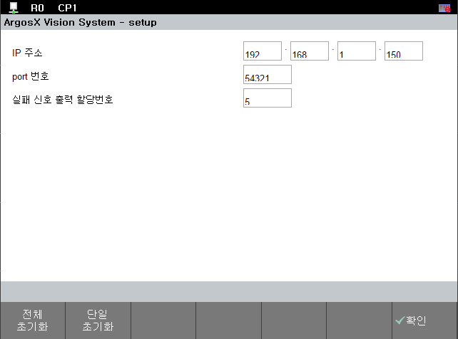

# 3.6.1.3 F 버튼 U/I의 번역 
F 버튼의 U/I의 내용을 번역하는 동작을 추가해봅시다.

## string data 추가
str_table.json 파일에 각 lang_code 별로 F 버튼 번역을 위한 string data를 추가해줍니다. 

``` json
        "en":
        {
            "IDS_msg_lb_all" : "Initialize\nAll",
            "IDS_msg_lb_one" : "Initialize\nOne"
        },
        "ko": 
        {
            "IDS_msg_lb_all" : "전체\n초기화",
            "IDS_msg_lb_one" : "단일\n초기화"
        }

```

## F버튼의 동작
기존에 구현되어 있는 initButtonBar 함수 내에 정의한 btn_infos의 내용에서 label의 값을 string id 로 수정해줍니다.

setup.js 

``` js
///@return		f-button infos array
function initButtonBar()
{
	console.log('initButtonBar()');	

	var btn_infos = [
		{
			label:"IDS_msg_lb_all",
			script: 'setAllValueAsDef();'
		},
		{
			label:"IDS_msg_lb_one",
			script: 'setSelectedValueAsDef();'
		}
	]
	return btn_infos;
}
```

가상 제어기와 TP를 재부팅한 뒤, 정상 동작이 된다면 아래와 같이 번역 처리된 F버튼을 확인하실 수 있습니다.



