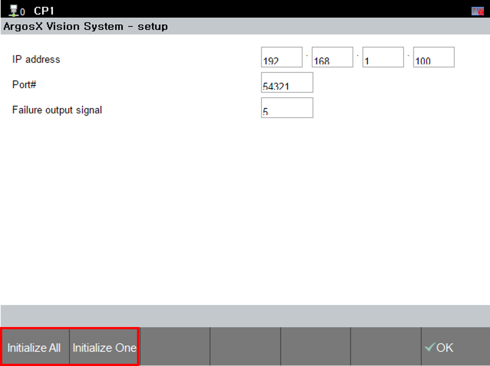

#### 3.6.1.3 翻译 F 按钮 UI

让我们为 F 按钮 UI 添加翻译支持。

<br>

##### 添加字符串数据

为每种语言代码将 F 按钮标签的字符串数据添加到 str_table.json。

```json
"en":
{
    "IDS_msg_lb_all" : "Initialize\nAll",
    "IDS_msg_lb_one" : "Initialize\nOne"
},
"ko":
{
    "IDS_msg_lb_all" : "Initialize\nAll",
    "IDS_msg_lb_one" : "Initialize\nOne"
}
```

每个标签文本通过字符串 ID 注册，以便根据所选语言进行显示。

<br>

##### F 按钮行为

修改在现有的 initButtonBar 函数中定义的 btn_infos 内的标签值，使其使用字符串 ID 而不是固定文本。

setup.js

```js
/// @return f-button infos array
function initButtonBar()
{
    console.log('initButtonBar()');

    var btn_infos = [
        {
            label: "IDS_msg_lb_all",
            script: 'setAllValueAsDef();'
        },
        {
            label: "IDS_msg_lb_one",
            script: 'setSelectedValueAsDef();'
        }
    ];

    return btn_infos;
}
```

将原始硬编码标签替换为相应的字符串 ID。

在重新启动虚拟控制器和 TP 后，F 按钮将使用根据所选语言翻译的文本显示。

