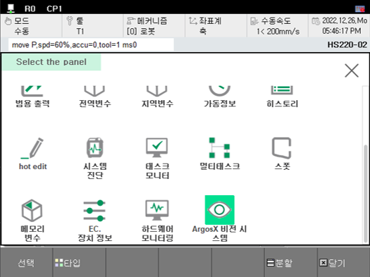
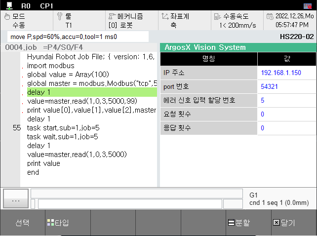

# 3.6.2 모니터링 panel U/I 다국어화
다음으로는 모니터링 panel에서의 번역 작업을 따라해봅시다.

## 1. menu의 주입
panel U/I 역시 menu에의 주입이 필요합니다.

모니터링 panel 메뉴에서 해당 panel 화면의 라벨을 확인하기 위해서 id를 추가해줍니다.
기존에 정의해둔 "IDS_title"를 다시 활용합니다.

menu.json
    
기존에 작성되어 있던 menu.json의 내용을 변경해봅시다.

``` json
    {
        "path": "panels",
        "id": "argosx",
        "icon": "argosx/ui/panel_argosx.png",
        "label": "IDS_title",
        "url": "argosx/ui/panel.html"
    }
```

label의 값을 기존의 "ArgosX Vision System"이 아닌 "IDS_title"로 작성해 줍니다.

정상적으로 반영이 된다면, 아래와 같이 모니터링 panel menu에서 번역이 반영 된 내용을 확인하실 수 있습니다.




## 2. panel layout에서의 변경

모니터링 화면의 U/I의 번역을 위해 먼저 panel.html을 살펴봅시다.

setup에서의 작업과 마찬가지로 str_table.json과 lang.js를 아래와 같이 script로 추가해 줍니다.

해당 파일들은 서로에게 종속성이 있기때문에 반드시 하기와 같은 순으로 작성해주어야 합니다.

```html
    <script src='./str_table.json' type='application/json'></script>
    <script src='../../_common/js/lang.js'></script>
```

또한 body에 선언되어 있는 table의 내용을 살펴 보면

```html
       <table>
		<th id = 'name'></th>
		<th id = 'value'></th>
		<tr>
			<td class='thd' id = 'lb_ip_addr'></td>
			<td id='ip_addr'></td>
		</tr>
		<tr>
			<td class='thd' id = 'lb_port'></td>
			<td id='port'></td>
		</tr>
		<tr>
			<td class='thd' id = 'lb_sigcode_err'></td>
			<td id='sigcode_err'></td>
		</tr>
		<tr>
			<td class='thd' id = 'lb_n_req'></td>
			<td id='n_req'></td>
		</tr>
		<tr>
			<td class='thd' id = 'lb_n_res'></td>
			<td id='n_res'></td>
		</tr>
	</table>
```

1) 번역 동작을 위하여 th와 td로 정의 되어 있는 table의 내용들에 각자 <b>id를 지정</b>합니다. 

2) 기존에 IP address 라고 작성되어 있는 td의 내용은 생략하셔도 무방합니다(추후에 번역된 내용들이 작성됩니다.)

    위와 같은 내용들을 다 반영한 html 파일은 아래와 같이 작성됩니다.

    panel.html

    ```html
    <!DOCTYPE html:5>
    <!--
        @author: Jane Doe, BlueOcean Robot & Automation, Ltd.
        @brief: ArgosX Vision System interface - panel
        @create: 2021-12-07
    -->
    <html>
    
    <head>
    <title>ArgosX Vision System</title>
    <meta http-equiv=Content-Type content='text/html; charset=utf-8'>
        <link rel='stylesheet' href='../../_common/css/style.css' type=text/css rel=stylesheet>
        <script src='../../_common/js/jquery-3.6.0.min.js'></script>
        <script src='./str_table.json' type='application/json'></script>
        <script src='../../_common/js/lang.js'></script>
        <script src='./panel.js'></script>
        <script> 
            $(document).ready(init);
        </script>
    </head>
    
    <body>
    <table>
            <th id = 'name'></th>
            <th id = 'value'></th>
            <tr>
                <td class='thd' id = 'lb_ip_addr'></td>
                <td id='ip_addr'></td>
            </tr>
            <tr>
                <td class='thd' id = 'lb_port'></td>
                <td id='port'></td>
            </tr>
            <tr>
                <td class='thd' id = 'lb_sigcode_err'></td>
                <td id='sigcode_err'></td>
            </tr>
            <tr>
                <td class='thd' id = 'lb_n_req'></td>
                <td id='n_req'></td>
            </tr>
            <tr>
                <td class='thd' id = 'lb_n_res'></td>
                <td id='n_res'></td>
            </tr>
        </table>
    </body>
    </html>
    ```

## 3. panel 번역 동작 추가
 
이제 panel 화면에 번역 동작을 추가해봅시다.

### 1) 초기화 

먼저 초기화 단계에서 str_table.json의 데이터를 로드해오는 동작과 Hi6에서 읽어온 lang_code를 개방화 플랫폼 다국어화에 반영시켜 주는 동작을 추가 해줍니다.

panel.js

```js
function init()
{
	parseStrData();
	setLangCode('/apps/argosx/svr_lang_code', updateAllStrByLang);
	updateData();
	setInterval('updateData()', 500);
}
```

setup.js에서와 동일하게 parseStrData, setLangcode를 추가하여 위와 같이 작성해줍니다.


### 2) lang_code에 따른 번역 지정
기존에 작성된 string data를 활용하는 부분은 그대로 두고, 추가적으로 필요한 elements들에 대한 내용을 str_table.json에 추가해줍니다.

str_table.json

```json
"en":
    {
          "IDS_InSigcodeErr" : "sigcode for error",
          "IDS_NReq" : "n.request",
          "IDS_NRes" : "n.response",
          "IDS_Name" : "name",
          "IDS_Value" : "value"
    },    
"ko": 
    {
        "IDS_InSigcodeErr" : "에러 신호 입력 할당 번호",
        "IDS_NReq" : "요청 횟수",
        "IDS_NRes" : "응답 횟수",
        "IDS_Name" : "명칭",
        "IDS_Value" : "값"
    }
```

다음으로, panel.js 에 하기 내용으로 수정해줍니다.

```js
function updateAllStrByLang()
{
	let se = setElemByLang;
	se('lb_ip_addr', 'IDS_IpAddr');
	se('lb_port', 'IDS_Port');
	se('lb_sigcode_err', 'IDS_InSigcodeErr');
	se('lb_n_req', 'IDS_NReq');
	se('lb_n_res', 'IDS_NRes');
	se('name', 'IDS_Name');
	se('value', 'IDS_Value');
}
```
panel의 경우 elements들의 명칭만 변경해주면 되기 때문에 updateAllStrByLang내에서 setElemByLang를 통해 string id를 지정해줍니다.

가상 제어기와 TP를 재부팅한 뒤, 정상 동작이 된다면 아래와 같은 모니터링 panel 화면을 확인하실 수 있습니다.

