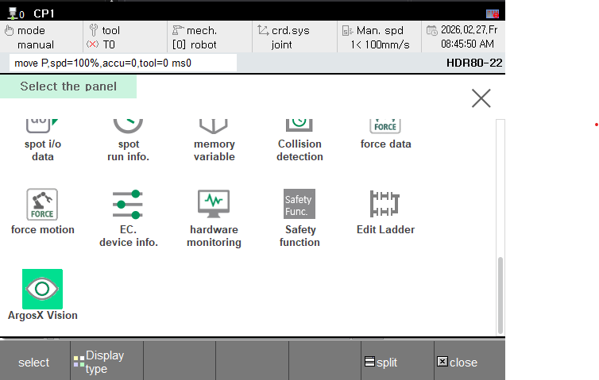
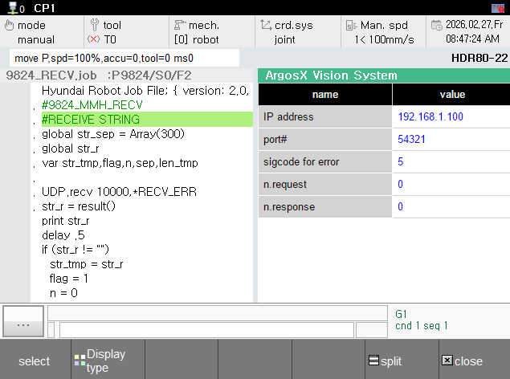

#### 3.6.2 Monitoring Panel UI Localization

Next, let's proceed with the translation work for the monitoring panel.

<br>

##### 1. Menu Translation

The panel UI also requires translation in the menu.

To display the panel screen label in the monitoring panel menu, add an id.  
Reuse the previously defined "IDS_title".

menu.json

Modify the existing menu.json as follows:

```json
{
    "path": "panels",
    "id": "argosx",
    "icon": "argosx/ui/panel_argosx.png",
    "label": "IDS_title",
    "url": "argosx/ui/panel.html"
}
```

Set the label value to "IDS_title" instead of the fixed text "ArgosX Vision System".

If applied correctly, the translated label will appear in the monitoring panel menu.



<br>

##### 2. Changes in the Panel Layout

To translate the monitoring screen UI, first review panel.html.

As with the setup screen, add str_table.json and lang.js as script files.

Because these files depend on each other, you must include them in the following order.

```html
<script src='./str_table.json' type='application/json'></script>
<script src='../../_common/js/lang.js'></script>
```

Next, check the table defined in the body:

```html
<table>
    <th id='name'></th>
    <th id='value'></th>
    <tr>
        <td class='thd' id='lb_ip_addr'></td>
        <td id='ip_addr'></td>
    </tr>
    <tr>
        <td class='thd' id='lb_port'></td>
        <td id='port'></td>
    </tr>
    <tr>
        <td class='thd' id='lb_sigcode_err'></td>
        <td id='sigcode_err'></td>
    </tr>
    <tr>
        <td class='thd' id='lb_n_req'></td>
        <td id='n_req'></td>
    </tr>
    <tr>
        <td class='thd' id='lb_n_res'></td>
        <td id='n_res'></td>
    </tr>
</table>
```

Steps:

1) Assign an id to each table header (th) and cell (td) for translation.  
2) You may remove any fixed text such as "IP address" because translated content will be inserted dynamically.

After applying these changes, the html file should look like this:

panel.html

```html
<!DOCTYPE html:5>
<!--
    @author: Jane Doe, BlueOcean Robot & Automation, Ltd.
    @brief: ArgosX Vision System interface - panel
    @create: 2021-12-07
-->
<html>

<head>
<title>ArgosX Vision System</title>
<meta http-equiv=Content-Type content='text/html; charset=utf-8'>
    <link rel='stylesheet' href='../../_common/css/style.css' type=text/css rel=stylesheet>
    <script src='../../_common/js/jquery-3.6.0.min.js'></script>
    <script src='./str_table.json' type='application/json'></script>
    <script src='../../_common/js/lang.js'></script>
    <script src='./panel.js'></script>
    <script>
        $(document).ready(init);
    </script>
</head>

<body>
<table>
    <th id='name'></th>
    <th id='value'></th>
    <tr>
        <td class='thd' id='lb_ip_addr'></td>
        <td id='ip_addr'></td>
    </tr>
    <tr>
        <td class='thd' id='lb_port'></td>
        <td id='port'></td>
    </tr>
    <tr>
        <td class='thd' id='lb_sigcode_err'></td>
        <td id='sigcode_err'></td>
    </tr>
    <tr>
        <td class='thd' id='lb_n_req'></td>
        <td id='n_req'></td>
    </tr>
    <tr>
        <td class='thd' id='lb_n_res'></td>
        <td id='n_res'></td>
    </tr>
</table>
</body>
</html>
```

<br>

##### 3. Add Panel Translation Behavior

Now, let's add translation behavior to the panel screen.

<br>

1) Initialization

During initialization, load string data from str_table.json and apply the lang_code from ${cont_model}.

panel.js

```js
function init()
{
    parseStrData();
    setLangCode('/apps/argosx/svr_lang_code', updateAllStrByLang);
    updateData();
    setInterval('updateData()', 500);
}
```

As in setup.js, add parseStrData and setLangCode.

<br>

2) Apply Translation According to lang_code

Keep the existing string data usage and add additional required elements to str_table.json.

```json
"en":
{
    "IDS_InSigcodeErr" : "sigcode for error",
    "IDS_NReq" : "n.request",
    "IDS_NRes" : "n.response",
    "IDS_Name" : "name",
    "IDS_Value" : "value"
},
"ko":
{
    "IDS_InSigcodeErr" : "error signal assignment number",
    "IDS_NReq" : "request count",
    "IDS_NRes" : "response count",
    "IDS_Name" : "name",
    "IDS_Value" : "value"
}
```

Next, modify panel.js as follows:

```js
function updateAllStrByLang()
{
    let se = setElemByLang;
    se('lb_ip_addr', 'IDS_IpAddr');
    se('lb_port', 'IDS_Port');
    se('lb_sigcode_err', 'IDS_InSigcodeErr');
    se('lb_n_req', 'IDS_NReq');
    se('lb_n_res', 'IDS_NRes');
    se('name', 'IDS_Name');
    se('value', 'IDS_Value');
}
```

Since the panel only requires updating element names, simply assign string IDs using setElemByLang inside updateAllStrByLang.

After rebooting the virtual controller and TP, the translated monitoring panel screen should be displayed correctly.


