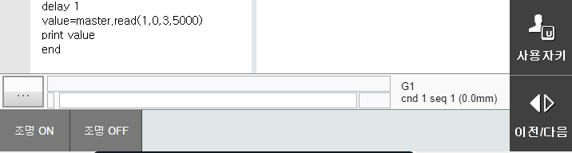

# 3.6.3 user-bar U/I 다국어화
## 1. user-bar layout에서의 변경

User-bar U/I의 번역을 위해 먼저 ubar.html을 살펴봅시다.
이전의 작업과 마찬가지로 str_table.json과 lang.js를 아래와 같이 script로 추가해 줍니다.

해당 파일들은 서로에게 종속성이 있기때문에 반드시 하기와 같은 순으로 작성해주어야 합니다.

또한 ubar.html에서는 기존에 없던 초기화 함수인 init을 정의해줄 것이기 때문에 아래와 같이 작성해줍니다.

ubar.html

```html
     <script src="./str_table.json" type="application/json"></script>
	 <script src='../../_common/js/lang.js'></script>
	 <script src='./ubar.js'></script>
	 <script> 
		$(document).ready(init);
	</script>

```

또한 body에 선언되어 있는 table의 내용을 살펴 보면

```html
	<button id='light-on' class='ubar-bt' onclick='light_onoff(true);'>light<br>on</button>
	<button id='light-off' class='ubar-bt' onclick='light_onoff(false);'>light<br>off</button>
```

기존에 light on 이라고 작성되어 있는 내용은 생략하셔도 무방합니다(추후에 번역된 내용들이 작성됩니다.)

위와 같은 내용들을 다 반영한 html 파일은 아래와 같이 작성됩니다.

ubar.html

```html
<!DOCTYPE html:5>
<!--
	@author: Jane Doe, BlueOcean Robot & Automation, Ltd.
	@brief: ArgosX Vision System interface - bar
	@create: 2021-12-07
-->
<html>
 
<head>
    <title>ArgosX</title>
	 <link rel='stylesheet' href='../../_common/css/style.css' type=text/css rel=stylesheet>
	 <script src='../../_common/js/jquery-3.6.0.min.js'></script>
	 <script src="./str_table.json" type="application/json"></script>
	 <script src='../../_common/js/lang.js'></script>
	 <script src='./ubar.js'></script>
	 <script> 
		$(document).ready(init);
	</script>
</head>
 
<body class='ubar'>
	<div class='ubar-title'>argosx</div>
	<button id='light-on' class='ubar-bt' onclick='light_onoff(true);'></button>
	<button id='light-off' class='ubar-bt' onclick='light_onoff(false);'></button>
</body>
</html>
```

## 2. user-bar 번역 동작 추가
 
이제 user-bar 화면에 번역 동작을 추가해봅시다.

### 1) 초기화 

먼저 초기화 단계에서 str_table.json의 데이터를 로드해오는 동작과 Hi6에서 읽어온 lang_code를 개방화 플랫폼 다국어화에 반영시켜 주는 동작을 추가 해줍니다.

ubar.js

```js
function init()
{
	parseStrData();
	setLangCode('/apps/argosx/svr_lang_code', updateAllStrByLang);
}
```

이전과 동일하게 parseStrData, setLangcode를 추가하여 위와 같이 작성해줍니다.


### 2) lang_code에 따른 번역 지정
추가적으로 필요한 elements들에 대한 내용을 str_table.json에 추가해줍니다.

str_table.json

```json
"en":
    {
          "IDS_msg_lb_all" : "Initialize\nAll",
          "IDS_msg_lb_one" : "Initialize\nOne"
    },    
"ko": 
    {
        "IDS_msg_lb_all" : "전체\n초기화",
        "IDS_msg_lb_one" : "단일\n초기화"
    }
```

다음으로, ubar.js 에 하기 내용으로 수정해줍니다.

```js
function updateAllStrByLang()
{
	setElemByLang('light-on', 'IDS_light_on');
	setElemByLang('light-off', 'IDS_light_off');

}
```
ubar의 경우 elements들의 명칭만 변경해주면 되기 때문에 setElemByLang를 통해 string id를 지정해줍니다.

가상 제어기와 TP를 재부팅한 뒤, 정상 동작이 된다면 아래와 같은 user-bar 화면을 확인하실 수 있습니다.

