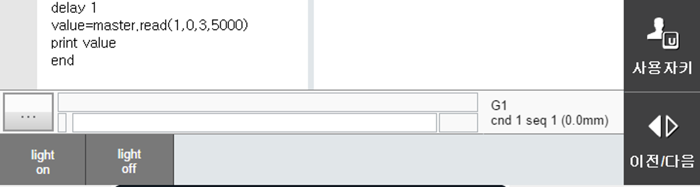

#### 3.6.3 用户栏 UI 本地化

##### 1. 用户栏布局的变化

要翻译用户栏 UI，首先打开并查看 ubar.html。

如前面的步骤一样，按如下所示添加 str_table.json 和 lang.js 作为脚本文件。

因为这些文件相互依赖，所以必须按照以下顺序包含它们。

另外，由于我们将在 ubar.html 中定义一个名为 init 的初始化函数（之前不存在），请按如下所示编写。

ubar.html

```html
<script src='./str_table.json' type='application/json'></script>
<script src='../../_common/js/lang.js'></script>
<script src='./ubar.js'></script>
<script>
    $(document).ready(init);
</script>
```

接下来，检查在 body 内声明的按钮：

```html
<button id='light-on' class='ubar-bt' onclick='light_onoff(true);'>light<br>on</button>
<button id='light-off' class='ubar-bt' onclick='light_onoff(false);'>light<br>off</button>
```

您可以删除现有文本，例如 "light on"。  
（翻译后的文本将稍后动态插入。）

在应用上述所有更改后，html 文件应如下所示：

ubar.html

```html
<!DOCTYPE html:5>
<!--
    @author: Jane Doe, BlueOcean Robot & Automation, Ltd.
    @brief: ArgosX Vision System interface - bar
    @create: 2021-12-07
-->
<html>

<head>
    <title>ArgosX</title>
    <link rel='stylesheet' href='../../_common/css/style.css' type=text/css rel=stylesheet>
    <script src='../../_common/js/jquery-3.6.0.min.js'></script>
    <script src='./str_table.json' type='application/json'></script>
    <script src='../../_common/js/lang.js'></script>
    <script src='./ubar.js'></script>
    <script>
        $(document).ready(init);
    </script>
</head>

<body class='ubar'>
    <div class='ubar-title'>argosx</div>
    <button id='light-on' class='ubar-bt' onclick='light_onoff(true);'></button>
    <button id='light-off' class='ubar-bt' onclick='light_onoff(false);'></button>
</body>
</html>
```

<br>

##### 2. 添加用户栏翻译行为

现在让我们添加翻译功能到用户栏界面。

<br>

1) 初始化

在初始化期间，从 str_table.json 加载字符串数据，并将从 ${cont_model} 读取的 lang_code 应用到平台的本地化系统。

ubar.js

```js
function init()
{
    parseStrData();
    setLangCode('/apps/argosx/svr_lang_code', updateAllStrByLang);
}
```

如前所述，添加 parseStrData 和 setLangCode。

<br>

2) 根据 lang_code 应用翻译

将所需的元素添加到 str_table.json。

```json
"en":
{
    "IDS_light_on" : "light on",
    "IDS_light_off" : "light off"
},
"ko":
{
    "IDS_light_on" : "Light ON",
    "IDS_light_off" : "Light OFF"
}
```

接下来，修改 ubar.js 如下：

```js
function updateAllStrByLang()
{
    setElemByLang('light-on', 'IDS_light_on');
    setElemByLang('light-off', 'IDS_light_off');
}
```

由于用户栏只需要更新元素标签，因此只需使用 setElemByLang 分配字符串 ID。

在重启虚拟控制器和 TP 后，翻译后的用户栏界面应正确显示。

