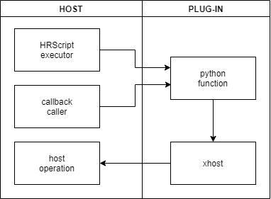
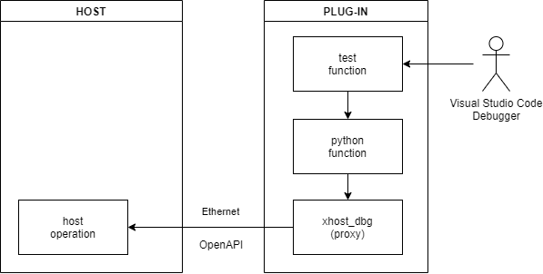
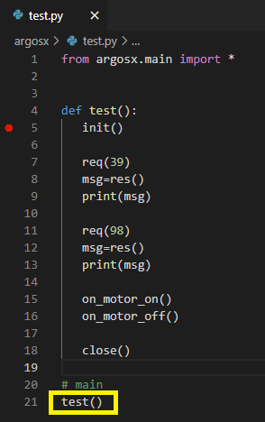
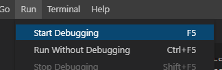
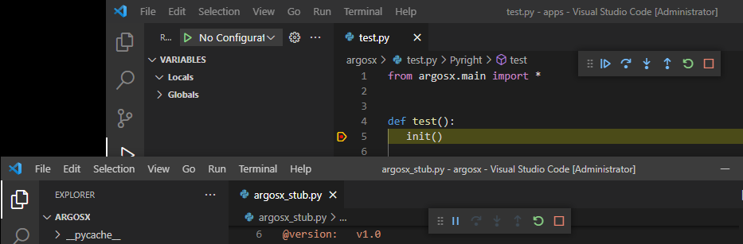
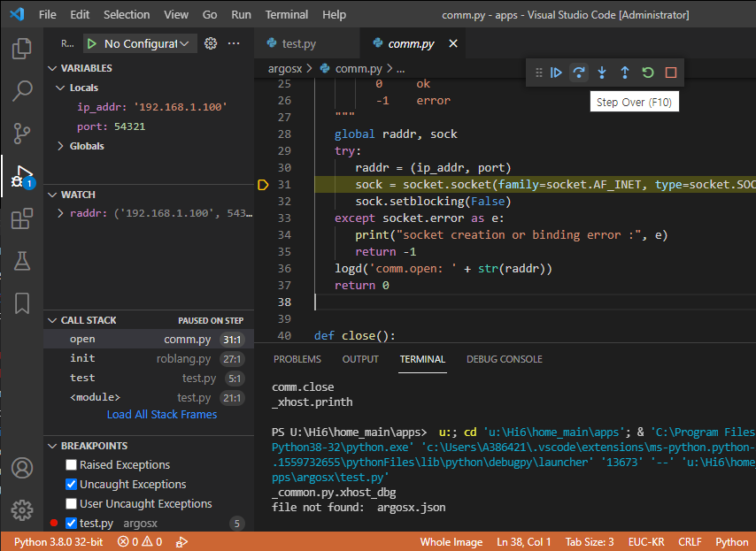
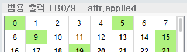

# 4.1 Debugging Python code

If the Python code we wrote has grammatical errors in the web UI or logical errors in the implementation body, a debugger should be used to trace the cause and supplement it.

However, the Python source code of the plug-ins is called from the Hi6 host through the Import operation, callback operation, or by a robot language. As there is no built-in Python debugger in the Hi6 host, tracing by placing a breakpoint to a call from the host is impossible. However, you can perform partial debugging by executing the entry function of a plug-in with an external debugger.


<br>

## xhost for debugging
xhost is a module to be used by plug-ins to call the functions of the Hi6 host. It is created and injected into the plug-in by the host. The figure below shows a typical operational flow between the host and a plug-in.
<br> 


However, when a plug-in is executed with the vscode debugger, an execution error will occur when the xhost method is called because there is no actual xhost module created/injected. Therefore, an alternative xhost for debugging should be used. In the common folder of the SDK, there is an alternative module, xhost_dbg. It is a kind of proxy that performs the host’s operations by calling an OpenAPI via Ethernet.

 
<br>


What you see below is a simple xhost.py in the apps/ folder that imports xhost_dbg. When the actual Hi6 host creates/injects xhost, it will override this xhost alternative module.


xhost.py
``` python
""" xhost for debug
   This module will be overridden by host.
"""
from _common.py.xhost_dbg import *
```

The host can be a Hi6 virtual controller running in a PC development environment or an actual controller. You need to designate where xhost_dbg should access.

There is xhost_remote_ip.py file in the apps/ folder of the Hi6 home path. The default value is set as the PC development environment itself (namely, the Hi6 virtual controller) as follows.


xhost_remote_ip.py
``` python
remote_ip="127.0.0.1"
```

If you want to perform testing by accessing the actual Hi6 controller with an IP address of "192.168.1.150", you can set it as follows.


xhost_remote_ip.py
``` python
remote_ip="192.168.1.150"
```


## Debugging with Visual Studio Code and test.py
If Microsoft Python extensions are properly installed in<u> 1.5 Installing the Visual Studio Code</u>, the Python debugging environment can be used. If you are already familiar with debugging Python in vscode, you can skip this section.


For tracing the functions to be called by a robot language or a callback operation, we defined the test module under the argosx/ folder, as shown in the figure below. Implement the routine that needs to be tested, then call the test( ) function from the main routine. 

You can toggle the breakpoint by clicking the left side of the line number.


test.py
<br></br>



When you press the F5 key in the test.py window or click the Run - Start Debugging menu, the execution will occur in Python runtime and in debugging mode.
<br></br>



For the ArgosX plug-ins in a previous section, you should execute the argosx_stub for the purpose of testing. If you need to run two Python programs, like in this case, you need to open two vscode sessions and run the debugger in each, as shown below.
<br></br>



When a breakpoint is placed, the VARIABLES, WATCH, CALL STACK, and BREAKPOINTS windows will open on the left. You can perform tracing with the operating buttons on the top right: Continue (F5), Step Over (F10), Step Into (F11), and Step Out (Shift+F11). If you click the Restart (Ctrl+Shift+F5) button, the execution will restart from the beginning. If you click the Stop (Shift+F5) button, debugging will stop.

When the print( ) command, a built-in Python function, is called, a string will be printed in the TERMINAL window at the bottom, and it can be used for debugging.
<br></br>



The operation of test.py is interlocked with the controller host by xhost_dbg, so debugging is possible while checking the actual operation as follows. 
<br></br>



