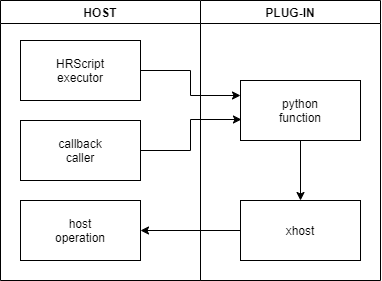
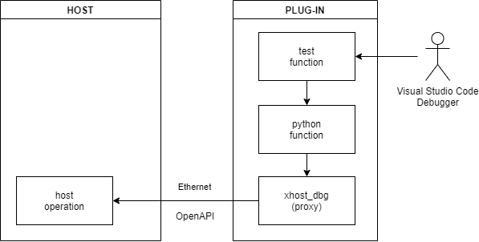
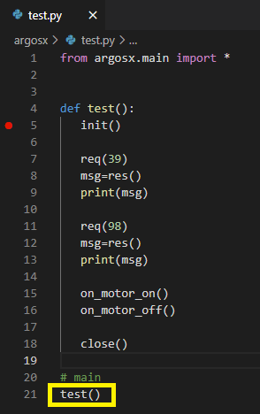
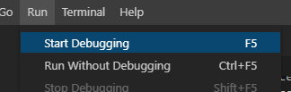
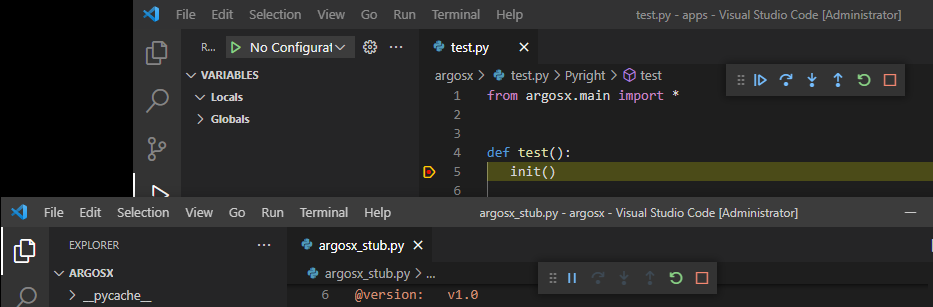
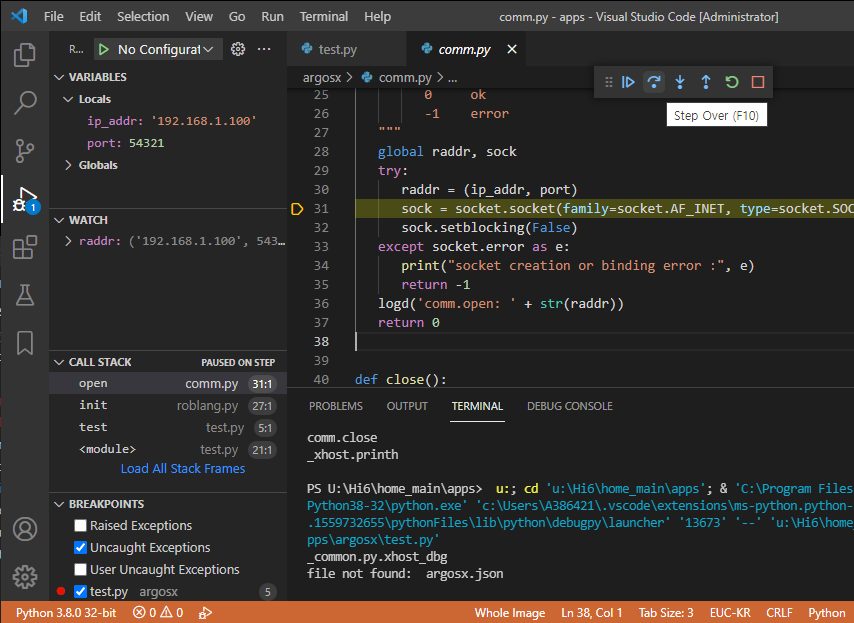
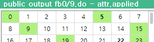

# 4.1 调试 Python 代码

如果我们编写的 Python 代码在 Web UI 中有语法错误或在实现主体中有逻辑错误，则应使用调试器来追踪原因并进行补充。

然而，插件的 Python 源代码是通过 Import 操作、回调操作或通过机器人语言从 ${cont_model} 主机调用的。由于 ${cont_model} 主机中没有内置的 Python 调试器，因此通过在主机的调用中放置断点进行追踪是不可能的。但是，您可以通过使用外部调试器执行插件的入口函数来进行部分调试。

<br>

#### 用于调试的 xhost
xhost 是一个由插件使用的模块，用于调用 ${cont_model} 主机的函数。它由主机创建并注入到插件中。下面的图展示了主机和插件之间的典型操作流程。
<br> 

但是，当使用 vscode 调试器执行插件时，调用 xhost 方法时会发生执行错误，因为没有实际创建/注入 xhost 模块。因此，应使用用于调试的替代 xhost。在 SDK 的公共文件夹中，有一个替代模块 xhost_dbg。它是一种通过以太网调用 OpenAPI 执行主机操作的代理。

 
<br>

您看到以下内容是 apps/ 文件夹中导入 xhost_dbg 的简单 xhost.py。当实际的 ${cont_model} 主机创建/注入 xhost 时，它将覆盖此 xhost 替代模块。

xhost.py
``` python
""" xhost for debug
   This module will be overridden by host.
"""
from _common.py.xhost_dbg import *
```

主机可以是运行在 PC 开发环境中的 ${cont_model} 虚拟控制器或实际控制器。您需要指定 xhost_dbg 应该访问的位置。

在 ${cont_model} 家庭路径的 apps/ 文件夹中有 xhost_remote_ip.py 文件。默认值设置为 PC 开发环境本身（即 ${cont_model} 虚拟控制器），如下所示。

xhost_remote_ip.py
``` python
remote_ip="127.0.0.1"
```

如果您想通过 IP 地址为 "192.168.1.150" 访问实际的 ${cont_model} 控制器进行测试，则可以按如下设置。

xhost_remote_ip.py
``` python
remote_ip="192.168.1.150"
```

#### 使用 Visual Studio Code 和 test.py 调试
如果在<u> 1.5 安装 Visual Studio Code</u> 中正确安装了 Microsoft Python 扩展，则可以使用 Python 调试环境。如果您已经熟悉在 vscode 中调试 Python，则可以跳过此部分。

为了追踪机器人语言或回调操作要调用的函数，我们在 argosx/ 文件夹下定义了测试模块，如下图所示。实现需要测试的例程，然后从主例程中调用 test( ) 函数。

您可以通过单击行号的左侧来切换断点。

test.py
<br></br>


当您在 test.py 窗口中按下 F5 键或单击运行 - 开始调试菜单时，将在 Python 运行时和调试模式下执行。
<br></br>


对于上一部分中的 ArgosX 插件，您应该执行 argosx_stub 以进行测试。如果您需要运行两个 Python 程序，如此情况，则需要打开两个 vscode 会话，并在每个会话中运行调试器，如下所示。
<br></br>


当放置断点时，左侧将打开 VARIABLES、WATCH、CALL STACK 和 BREAKPOINTS 窗口。您可以使用右上角的操作按钮进行跟踪：继续 (F5)、逐步跳过 (F10)、逐步进入 (F11) 和逐步退出 (Shift+F11)。如果单击重启 (Ctrl+Shift+F5) 按钮，则执行将从头开始。如果单击停止 (Shift+F5) 按钮，则调试将停止。

当调用 print( ) 命令时，一个内置的 Python 函数将在底部的 TERMINAL 窗口中打印字符串，可以用于调试。
<br></br>


test.py 的操作通过 xhost_dbg 与控制器主机相互联动，因此可以在检查实际操作的同时进行调试，如下所示。
<br></br>
