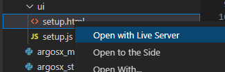
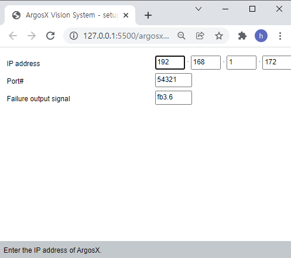
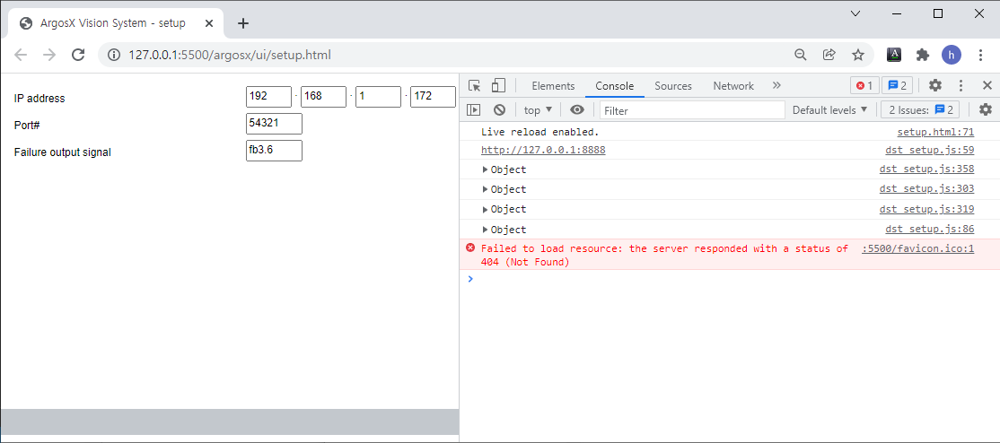
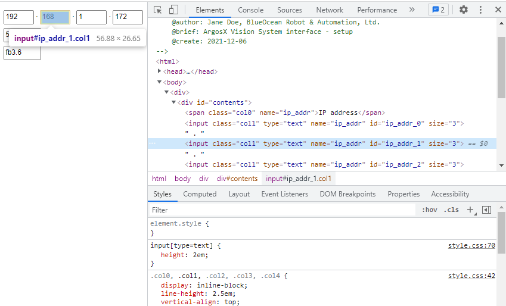
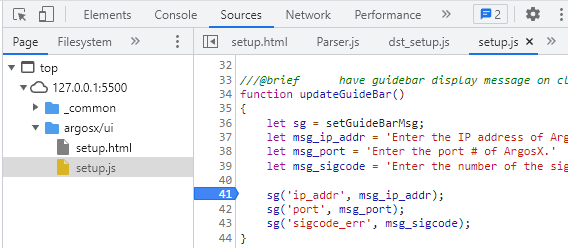
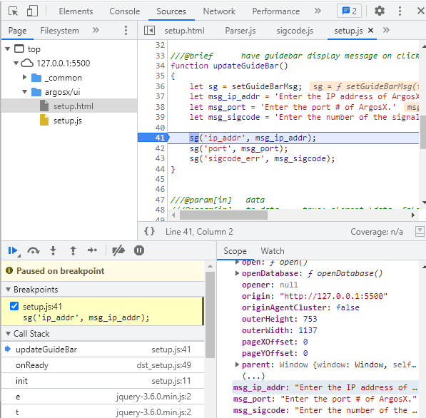
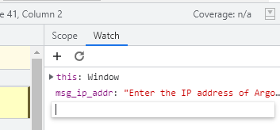
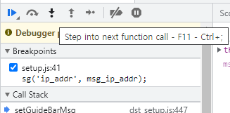
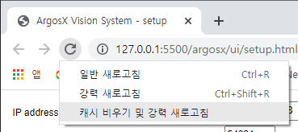
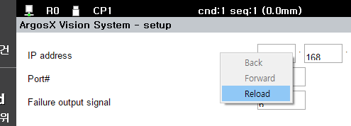

# 4.2 web 기반 U/I의 디버깅

티치펜던트에서 web UI를 시험하기 전, 우리는 Chrome 웹 브라우저로 화면을 미리 시험해볼 수 있었습니다.

우리가 작성한 web U/I에 javascript 문법오류 혹은 구현체의 논리적인 오류가 있으면, 디버거를 동원해 원인을 추적하여 보완해야 합니다. 그런데 Chrome 웹 브라우저는 Chrome Development Tools (줄여서 Chrome DevTools)라는 디버거를 자체 내장하고 있으므로 이를 활용하면 됩니다. 이번 장에서는 Web U/I의 디버깅 방법에 대해서 알아보겠습니다. 이미 Chrome DevTools 사용에 익숙하다면 이 장은 건너뛰어도 됩니다.

## Live server 로 web UI 실행

<u>설정화면의 레이아웃</u> 절에서 argosx 플러그인의 setup.html을 Chrome 웹 브라우저로 실행해본 바 있습니다.

다시한번 실행해봅시다.

가상제어기의 argosx가 정상적으로 import된 상태여야 합니다.

vscode에 setup.html이 열린 상태에서 우하단의 Go Live 버튼을 클릭하여 Live server를 실행합니다.

혹은, setup.html에 대해 우버튼으로 팝업 메뉴를 열고 "Open with Live Server"를 선택합니다.

아래와 같이 Chrome 웹 브라우저로 setup.html이 열렸습니다.

## Chrome DevTools

F12 버튼을 누르면 브라우저 우측에 Chrome DevTools가 열립니다. 아래 그림에서는 DevTools의 상단 메뉴 Console이 선택되어 있습니다. javascript에서 console.log( )로 문자열을 호출하면, 이 console 창에 문자열이 출력됩니다. 이 때, log( )가 호출된 소스코드 위치도 함께 표시되고, 클릭하여 해당 소스코드 위치로 이동할 수 있기 때문에, 디버깅 용도로 유용합니다.

DevTools의 상단 메뉴에서 Elements를 선택하면 html 파일의 계층 구조를 볼 수 있습니다. html 파일의 특정한 element를 선택하면, 좌측 렌더링 화면에서 해당 element가 강조되며, 우하단에는 CSS style이 표시됩니다.

Sources 메뉴를 선택하면, javascript 소스코드 파일들이 tree구조로 나타납니다. 원하는 파일을 선택해 열고 소스코드를 확인할 수 있으며, 좌측의 line번호를 클릭하여 breakpoint를 토글할 수 있습니다.

좌측의 html 렌더링 화면의 update 버튼을 클릭하거나 F5 키를 누르면, web UI가 갱신되면서 javascript가 처음부터 재실행됩니다. breakpoint에서 실행커서가 멈춘 것을 볼 수 있습니다. 그림 하단을 보면 Breakpoints와 Call Stack 창이 보이는데 항목을 클릭하여 해당하는 소스코드 위치로 이동할 수 있습니다.

우 하단의 Scope에는 Local 변수들이 나타나며, Scope 우측의 Watch 메뉴를 선택하면 원하는 변수를 추가하여 값을 관찰할 수 있습니다.

VisualStudio나 Eclipse 같은 통합개발환경의 사용자라면, 매우 익숙한 디버깅 환경입니다.

breakpoint에 걸린 상태에서는 trace가 가능합니다. Breakpoints 창 위의 조작 버튼 그룹으로 Resume(F8), Step over(F10), Step into(F11), Step out(Shift+F11)을 할 수 있습니다.

## 소스코드의 수정과 재실행

html이나 css, javascript 소스코드를 수정한 후, 웹 브라우저에서 update 버튼을 클릭하거나 F5 키를 누르면, 수정된 내용으로 재실행됩니다.

그런데 웹 브라우저에는 cache가 있기 때문에, 소스코드를 수정하고 재실행 해도 변경사항이 반영 안 되는 경우가 간혹 있습니다. 이 때는 update 버튼에 마우스 우버튼을 클릭해 팝업 메뉴를 열고 '캐시 비우기 및 강력 새로고침'을 선택하면 해결됩니다. (이 팝업 메뉴는 DevTools가 열려 있을 때만 사용 가능합니다.)

웹 브라우저가 아닌 가상 티치펜던트에서도 새로고침을 할 수 있습니다. 웹 U/I 화면에 마우스 우버튼을 클릭하면 팝업 창이 열립니다. Reload 메뉴를 선택하면, 소스코드의 수정 내용이 즉각 반영됩니다.

