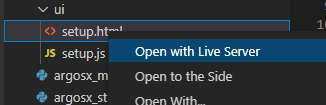
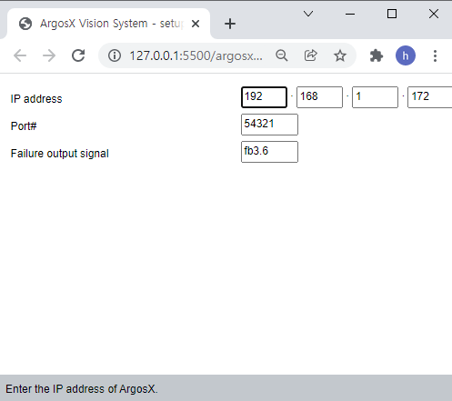
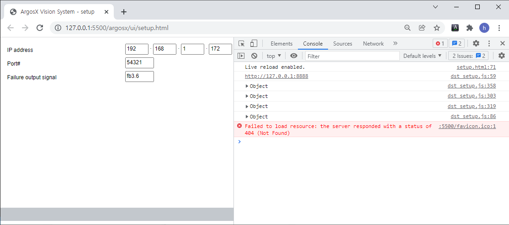
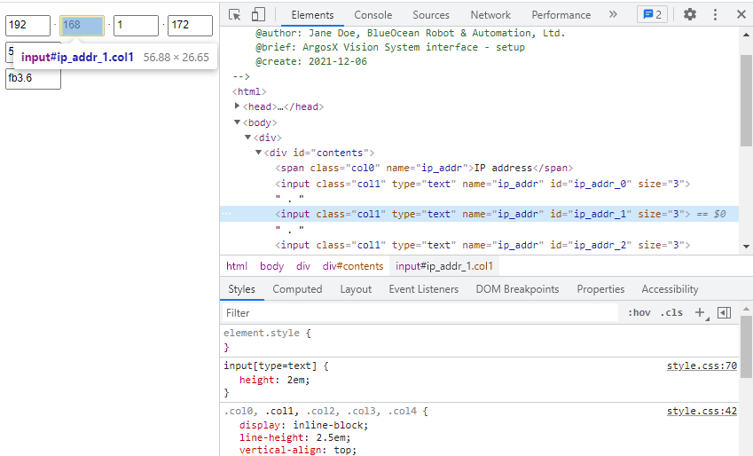
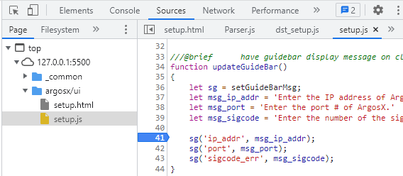
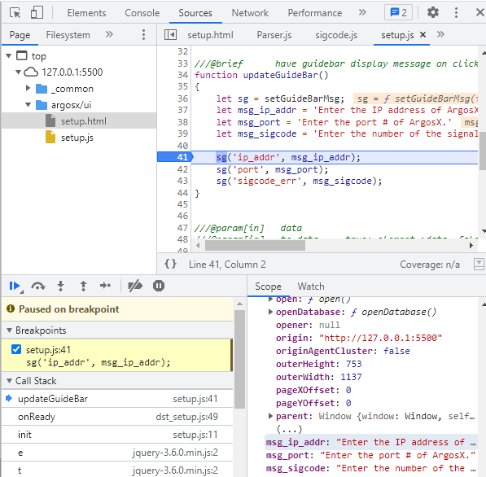
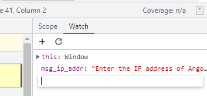
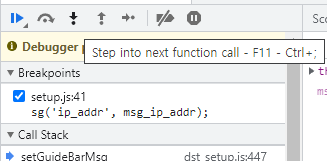
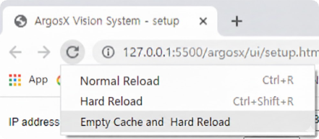
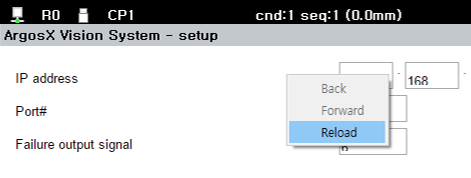

# 4.2 调试基于Web的用户界面

在教导挂件上测试Web用户界面之前，我们可以通过Google Chrome网络浏览器预先测试屏幕。

如果我们编写的Web用户界面在JavaScript中存在语法错误或实现主体中的逻辑错误，则应使用调试器追踪原因并进行补充。此外，Google Chrome网络浏览器中有一个内置的调试器，称为Chrome开发工具（缩写为Chrome DevTools），因此您可以使用它。在本节中，我们将学习如何调试Web用户界面。如果您已经熟悉使用Chrome DevTools，可以跳过此部分。

#### 使用Live服务器执行Web用户界面

在<u>设置屏幕的布局</u>部分中，我们曾经练习过使用Google Chrome网络浏览器执行ArgosX插件的setup.html。

让我们再次执行它。

虚拟控制器的ArgosX应处于正常导入状态。

当setup.html在vscode中打开时，您需要点击右下角的Go Live按钮来运行Live服务器。

或者，您可以通过右键单击setup.html打开弹出菜单，然后选择“用Live Server打开”。

如您所见，setup.html已在Chrome网络浏览器中打开。

#### Chrome开发工具

当您按下F12按钮时，Chrome开发工具将在浏览器的右侧打开。在下面的图片中，DevTools顶部的菜单Console被选中。当在JavaScript中使用console.log()调用字符串时，该字符串将打印在此控制台窗口中。在此过程中，调用log( )的源代码位置也会显示，从而允许您单击以跳转到源代码位置，使调试器在调试时非常有用。

选择顶部 DevTools 菜单中的元素可以让您看到 html 文件的层次结构。当您在 html 文件中选择特定元素时，相关元素将在左侧渲染屏幕上高亮显示，而 CSS 样式将在右下角显示。

选择 Sources 菜单时，JavaScript 源代码文件将以树状结构出现。您可以选择并打开所需的文件并检查源代码。您还可以通过单击左侧的行号来切换断点。

单击左侧 html 渲染屏幕上的更新按钮或按 F5 键将更新网页 UI，并使 JavaScript 从头开始运行。您可以看到执行光标停在断点处。您还可以在图像底部看到断点和调用堆栈窗口，您可以通过单击相关项目转到源代码的位置。

右下角的 Scope 菜单显示局部变量，如果您在 Scope 菜单右侧选择 Watch 菜单，您可以添加并观察所需的变量。

对于集成开发环境的用户，如 Visual Studio 或 Eclipse，该环境将是一个非常熟悉的调试环境。

当放置断点时，可以进行追踪。您可以使用断点窗口上方的操作按钮组执行 Resume (F8)、Step over (F10)、Step into (F11) 和 Step out (Shift+F11) 操作。

#### 修改和重新执行源代码

在修改 html、CSS 和 JavaScript 的源代码后，如果您在网页浏览器中单击更新按钮或按 F5 键，执行将基于修改后的内容进行。

此外，由于网页浏览器具有缓存，即使源代码已修改并重新执行，修改可能不会反映到网页中。在这种情况下，您可以通过右键单击更新按钮并打开弹出菜单，然后选择“清除缓存并强制刷新”菜单来解决问题（此弹出菜单仅在 DevTools 打开时可用）。

刷新也可以通过虚拟教学挂件而不是在网页浏览器中进行。在网页 U/I 屏幕上右键单击将打开弹出窗口。如果您在这里选择重新加载菜单，源代码中所做的修改将立即反映出来。
