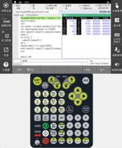
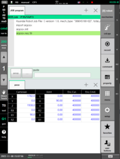

# 1.3 安装 ${cont_model} 虚拟控制器

(临时)
<br></br>

## 1) 安装
解压下载的 ${cont_model} 控制器 zip 文件。

### 安装虚拟机器人控制器 (VRC) 开发环境
1. 复制并确保路径为 D:\util\hi6_vrc\。
   (在 hi6main_platform_cfg.json 和 hi6tp_platform_cfg.json 中记录的文件夹路径应修改以更改文件夹路径。)
2. 通过执行安装文件夹中的 vcredist_x64.exe 文件安装 Visual Studio 2013 可再发行包。
3. 将安装文件夹中 System32 和 SysWOW64 文件夹的内容复制到 C:\Windows\ 的相关单独文件夹中。

### 安装 Qt 库
1. 创建路径 C:\Qt\Qt5.7.1\5.7。
2. 在该路径下解压 msvc2013。

### 安装 Python
请参考<u> 1.4 安装 Python 3 开发环境 </u> 的内容。

<span style = 'background-color:#ffdce0'> 注意：为了成功安装，执行期间必须连接到 Internet。</span>

1. 执行安装文件夹中的 "python-3.8.0.exe" 文件。
2. 仅选中 Add Python 3.8 to PATH，然后单击 Customize installation。
3. 随后勾选所有项目的复选框并开始安装。
4. 当确认“安装成功”消息时结束。
5. 将 "ucrtbased.dll" 和 "vcruntime140d.dll" 文件从安装文件夹复制到 C:\Program Files (x86)\Python38-32\。


## 2) 执行
1. 在调试文件夹中执行 hi6_main.exe。
2. 在调试文件夹中运行 PowerShell，然后使用以下命令运行教导挂件 (TP)。
   ```
    ./hi6_tp -layout=k
   ```

- 如果立即执行 hi6_tp，将执行 <U>TP600</U>。

- <U>TP630</U> 是 ${cont_model} TP 的实际目标模型。因此，为了正确执行此操作，您需要通过命令输入 '-layout=k' 来运行 TP630。

<b>TP630</b>&nbsp;  

<b>TP600</b>&nbsp;

   ### 在需要与 HRSpace 联锁时
    1. 从 https://hd-hyundairobotics.com/biz/product/support/291 下载 HRSpace 并安装。
    2. 右键单击工作区并使用“加载模型”加载机器人。
    3. 右键单击机器人并在“机器人属性”中选择“ENetHi6”以连接控制器。
    4. 将 PC 和机器人控制器的 IP 地址设置为“127.0.0.1”。
    5. 按下开始仿真按钮。


<br></br>
(与控制器安装相关的内容将与安装程序相关的内容一起稍后改进)